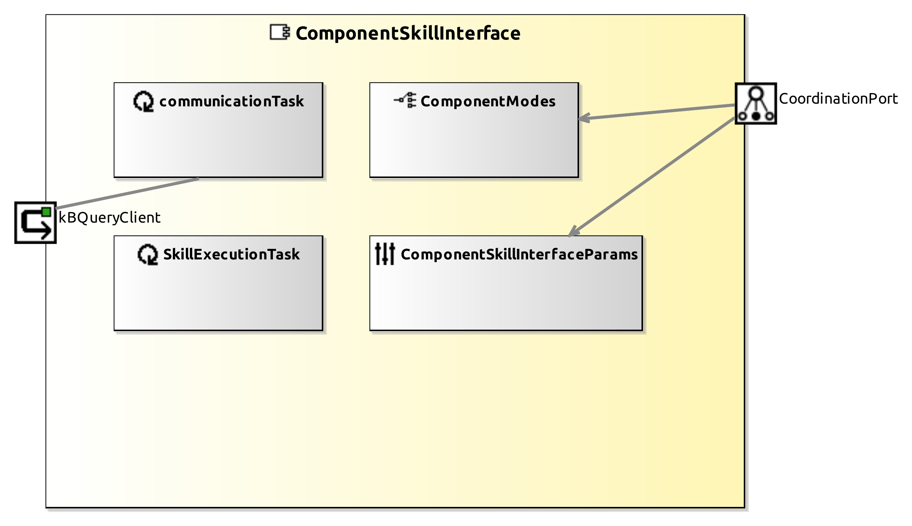

# ComponentSkillInterface Component

The core of the `ComponentSkillInterface` in the `SkillExecutionTask.cc` has been updated for managing the reception of the skill from the BT Executor and storing it in the `ComponentKB`. Briefly, it incorporates code for
- Reading the whole skill (including its a priori unknown collection of in- and out-attributes. A maximum of three in-attributes and three out-attributes are allowed. 
- Updating the skill on the Knowledge Base
- Querying the skill_result from the `ComponentKB`. When the execution of the skill ends, the `ComponentSequencer` sets the name of the skill_result on the `ComponentKB` with the name of the executed skill.

## Service Ports

## Component Parameters ComponentSkillInterfaceParams

### InternalParameter Settings

| Attribute Name | Attribute Type | Description |
|----------------|----------------|-------------|
| communicationType | InlineEnumeration |  |
| ip | String |  |
| port | UInt32 |  |
| use_socket_timeout | Boolean |  |
| socket_timeout_s | UInt32 | timeout in sec, do not use small values (<2 sec), risk of loosing data, due to client side closed connection! |
| verbose | Boolean |  |

