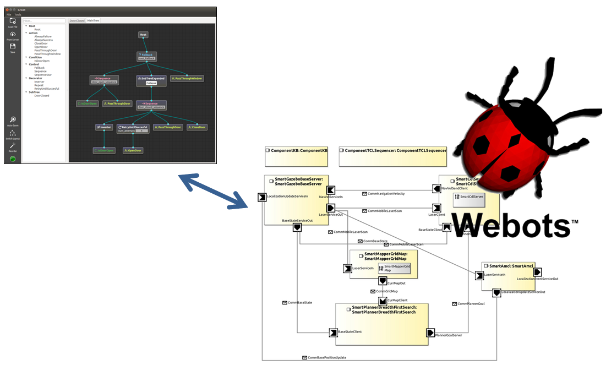

# MiRON-project

## Current snapshot

Our current framework includes the Behavior Tree (BT) Executor and a system architecture builds on SmartMDSD. Environment and robot are simulated using Webots (https://github.com/cyberbotics/AROSYS). 

The first step was to close a complete loop where the BT executor drives the course of action sending skills to a SkillInterface component on the smartMDSD environment. The received skill will be updated on the knowledge base (KB component), allowing the Sequencer component to manage its execution.

### Behavior Tree (BT) Executor

The BT Executor employs the version 3.x of the BT library (https://github.com/BehaviorTree/BehaviorTree.CPP). In this new version of the BT, the implementation follows the guidelines of Model Driven Development, separating the role of the Component Developer from the Behavior Designer. Thus, working as Behavior Designer, we do not need to read nor modify the source code of a given TreeNode.

### SystemMiRONTiagoNavigation

This system is built with Components from the Servicerobotics-Ulm repository (https://github.com/Servicerobotics-Ulm/ComponentRepository) and the AROSYS ITP project (https://github.com/cyberbotics/AROSYS). It is based on the  `SystemTiagoNavigation` system, but incorporates significant changes for managing the skill within the architecture.

#### Modified Components and Behaviors

SkillInterface

BehaviorNavigationModule

StartUp

#### Servicerobotics-Ulm Components

#### AROSYS Components

ComponentWebots

ComponentWebotsBumper

ComponentWebotsLidar

ComponentWebotsTIAGo

#### Testing
- ABR_test.xml - Example of Behavior tree
- ABR_SystemTiagoNavigation.skills.json - File with the bounded collection of skills that are currently managed by the Sequencer
- SystemTiagoNavigation.skills.json - File with the whole collection of skills from the SystemTiagoNavigation environment on SmartMDSD

# Compilation instructions (Ubuntu Linux) 
`mkdir build`  
`cd build`  
`cmake ..`  
`make`
