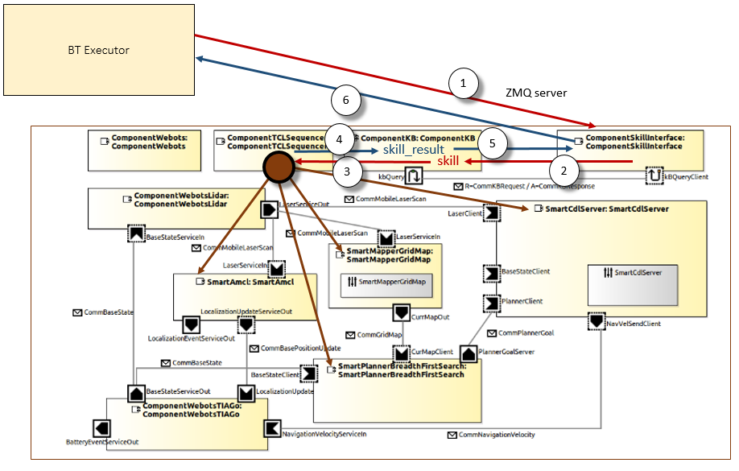
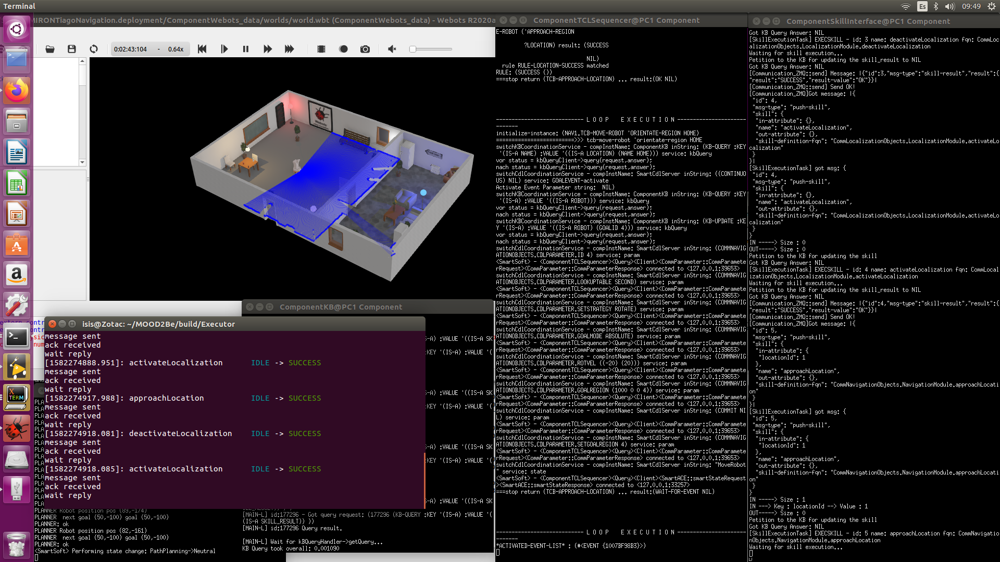

# MiRON-project

## Current snapshot

Our current framework includes the Behavior Tree (BT) Executor and a system architecture builds on SmartMDSD. Environment and robot are simulated using Webots (https://github.com/cyberbotics/AROSYS). 

The first step was to close a complete loop where the `BT Executor` drives the course of action sending skills to the `ComponentSkillInterface` on the SmartMDSD environment. The received `skill` will be updated on the knowledge base (`ComponentKB`), allowing the `ComponentSequencer` to manage its execution. The `skill_result` follows the reverse path, being noted in the `ComponentKB` by the `ComponentSequencer` and sent by the `ComponentSkillInterface`, through a ZMQ server, to the `BT Executor`.

### Behavior Tree (BT) Executor

The `BT Executor` employs the version 3.x of the BT library (https://github.com/BehaviorTree/BehaviorTree.CPP). In this new version of the BT, the implementation follows the guidelines of Model Driven Development, separating the role of the Component Developer from the Behavior Designer. Thus, working as Behavior Designer, we do not need to read nor modify the source code of a given TreeNode.

### SystemMiRONTiagoNavigation

This system is built with Components from the Servicerobotics-Ulm repository (https://github.com/Servicerobotics-Ulm/ComponentRepository) and the AROSYS ITP project (https://github.com/cyberbotics/AROSYS). It is based on the  `SystemTiagoNavigation` system, but incorporates significant changes for managing the skill within the architecture.

#### Modified Components and Behaviors

- `ComponentSkillInterface`: The `SkillExecutionTask.cc` module has been modified for capturing the skill from the ZMQ server and annotate it on the `ComponentKB`. After updating a skill, the component will poll the `ComponentKB` for obtaining the associated response (i.e. `skill_result`).
- `BehaviorNavigationScenario.smartTcl`: Minor changes for updating a NIL `skill` and `skill_result` on the `ComponentKB`. 
- `startUp.smartTcl`: Relevant changes for polling the `ComponentKB` and capturing the new skills and manage them, writing on the `ComponentKB` the resulting `skill_results`. Currently, only three skills are considered: `ACTIVATELOCALIZATION`, `APPROACHLOCATION`, and `DEACTIVATELOCALIZATION`.

#### Servicerobotics-Ulm Components

- `ComponentTCLSequencer`
- `ComponentKB`
- `SmartCdlServer`
- `SmartMapperGridMap`
- `SmartPlannerBreadthFirstSearch`
- `SmartAmcl`

#### AROSYS Components

- `ComponentWebots`
- `ComponentWebotsLidar`
- `ComponentWebotsTIAGo`

#### Testing

- `ABR_test.xml`: Example of Behavior tree
- `SystemTiagoNavigation.skills.json`: File with the whole collection of skills from the `SystemTiagoNavigation` environment on SmartMDSD

# Compilation instructions (Ubuntu Linux) 
`mkdir build`  
`cd build`  
`cmake ..`  
`make`
